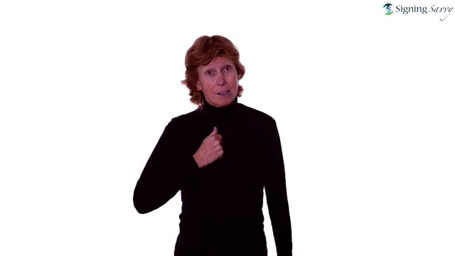
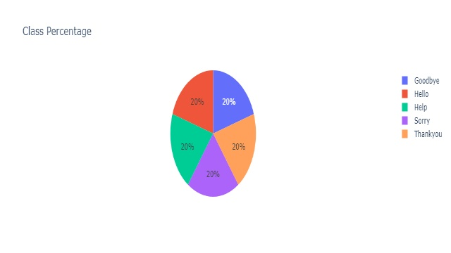

# Sign Language Detection Project

## Demo

## Description
It is a sign language detection project, used to ease the communication between normal people and deaf-mute individuals. The project focuses on detecting American Sign Language (ASL) gestures for the following signs: Goodbye, Hello, Help, Sorry, Thank you.

## ASL Signs
 | 
------------------------------------|---------------------------------
**Goodbye**                         | **Hello**
****        | ****
**Help**                            | **Sorry**
**** | ****
**Thank you**                       | **Balanced Dataset**

## Steps
1. **Collecting Images for the 5 Sign Languages:**
   - Since there is no given dataset, we created our own dataset.
   - Used webcam to capture images of the sign languages.
   - Extracted frames from tutorial videos to increase the dataset size and add variety.
     - [Signing Savvy](https://www.signingsavvy.com/)
     - [Sign ASL](https://www.signasl.org/)

2. **Extracting Features with Mediapipe:**
   - We used the Mediapipe module to extract features from the images.
   - This step is crucial for focusing the model on specific hand gestures.
   - Hand landmarks were detected and used as features for training.
   - The resulting dataset: extracted features and labels -> stored in `data.pickle`.

3. **Splitting Dataset:**
   - 80% of the dataset was allocated for training, and the rest for testing.
   - The dataset was balanced, ensuring each class had the same number of samples.
   - This helped avoid bias towards specific classes.

4. **Training the Model:**
   - Random Forest algorithm was used for the model.
   - Trained the model on the training data.
   - Saved the trained model in `model.pickle` for later use.

5. **Evaluation:**
   - Tested the model using the test data.
   - Calculated metrics like Confusion Matrix.
   - Achieved an accuracy score of 98.5% for this task.

